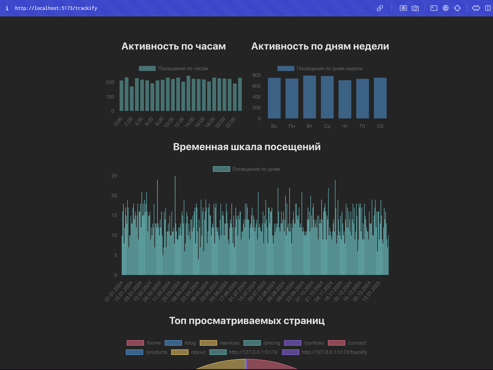

# Trackify
React library that allows you to get analytics of user's experience

## Installing

1. Step 1:

Install trackify
```bash
npm i trackify
```

2. Step 2:
Install server for trackify
```bash
git clone https://github.com/webHikari/Trackify-Server
```
Then start it with NPM
```bash
npm install && npm run dev
```
Or you can do it with BUN
```bash
bun install && bun run dev
```

3. Step 3:

Just cover Trackify around your app like this, also you need to specify a Trackify-Server URL
```ts
import { TrackifyProvider } from "trackify";

return(
    <TrackifyProvider TR_URL="http://localhost:3000">
        <App />
    </TrackifyProvider>
);
```

4. Step 4: 
Put anywhere TrackifyPage, i recommend to use it with react-router-dom
```ts
import { createRoot } from "react-dom/client";
import App from "./App.tsx";
import { TrackifyProvider, TrackifyPage } from "trackify";
import { Routes, Route, BrowserRouter } from "react-router-dom";

createRoot(document.getElementById("root")!).render(
    <TrackifyProvider TR_URL="http://127.0.0.1:3000">
        <BrowserRouter>
            <Routes>
                <Route path="/" element={<App />} />
                <Route path="/trackify" element={<TrackifyPage />} />
            </Routes>
        </BrowserRouter>
    </TrackifyProvider>
);
```

5. Step 5: Go to /trackify route and check out analytics of your app



